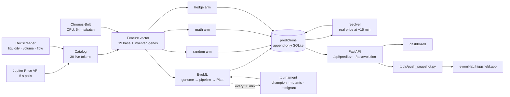

<div align="center">

# EvoML

**A self-evolving model foundation for decisions under uncertainty, with an
honest scoreboard.**

EvoML rewrites its own genome every 30 minutes, writes its own neural network
from first principles, and refuses to believe itself until pre-registered
gates are cleared against a random control on identical data. Two test
benches, same loop: live 15-minute crypto direction (the hardest public
stress test we could find) and public credit-card fraud (the fintech
problem it is meant for). Runs on a laptop CPU. No AI API key.

[Live site + growth visualisation](https://evoml-lab.higgsfield.app) ·
[Live dashboard (raw, on EC2)](http://65.2.213.196:8765) ·
[5-minute pitch video](https://cdn.pika.art/v2/files/agent/3d269d9f-8218-41c2-b660-99e4731710ba/output.mp4) ·
[Results](docs/RESULTS.md) · [Architecture](docs/ARCHITECTURE.md) ·
[How evolution works](docs/EVOLUTION.md) · [Submission](docs/SUBMISSION.md)

   

</div>

> **Measurement-only by design.** There is no wallet integration, no
> private-key handling, and no code path that can sign or submit a
> transaction. Requests to add live trading are declined.

---

## Table of contents

1. [Results](#results)
2. [What is new](#what-is-new)
3. [How it works](#how-it-works)
4. [Quick start](#quick-start)
5. [Repository layout](#repository-layout)
6. [Verify the numbers yourself](#verify-the-numbers-yourself)
7. [Honest caveats](#honest-caveats)
8. [Why this matters for fintech](#why-this-matters-for-fintech)
9. [Roadmap](#roadmap)
10. [License](#license)

---

## Results

Live run, pre-registered gates, no backtests. Snapshot taken 2026-09-06 01:20 IST
after 14.6 days. Numbers move as the run continues; the live site shows the
current values.

| Arm | Resolved calls | Accuracy | Note |
|---|---:|---:|---|
| **EvoML** (subject) | 572 | **56.3 %** | skill z = 3.01 against 50 % |
| Random control | 1 387 | 50.5 % | same coins, same windows |
| Regime hedge (6 experts incl. Chronos) | 1 635 | 52.6 % | multiplicative-weights hedge |
| Classic math (OU z-score + variance ratio) | 1 622 | 49.3 % | 1930 / 1988 textbook signals |
| Chronos-Bolt alone (Amazon, 47.7 M params) | ~930 | 51.5 % | a coin flip on its own |

Pre-registered pass/fail gates, all passed:

| Gate | Threshold | Actual |
|---|---|---|
| Skill against chance | z ≥ 1.64 | **3.01** |
| Sample size | ≥ 200 resolved | **572** |
| Duration | ≥ 14 days | **14.6** |
| Beats random control | two-proportion z ≥ 1.64 | **2.32** |

Full methodology, definitions and the reproduction procedure are in
[docs/RESULTS.md](docs/RESULTS.md).

### Second bench: credit-card fraud (the fintech problem)

Same loop, different data: the public ULB credit-card fraud set (284,807
transactions, 0.17 % fraud) from OpenML, time-ordered with purged splits, a
random control and a balanced logistic-regression baseline scored on the same
future window, and three gates written down before the run
(`bench/fraud_bench.py`). One command, 90 seconds on a laptop CPU.

| Scorer | PR-AUC | Precision @0.5 % alerts | Recall @0.5 % alerts |
|---|---:|---:|---:|
| **EvoML** (champion: from-scratch `net24x12`) | **0.776** | 0.222 | **0.845** |
| Balanced logistic regression | 0.770 | 0.222 | 0.845 |
| Random control | 0.002 | 0.004 | 0.014 |

Gates: beats random (95 % CI on the PR-AUC gap [0.70, 0.86]) **pass**; recall
at the fixed 0.5 % alert budget ≥ 0.70 **pass**; non-inferior to the baseline
**pass**. It does not *significantly* beat the tuned baseline (CI on the gap
[−0.03, +0.05]); we report that rather than hide it. The point is the loop:
the evolved champion, a network written from scratch, reached a strong
baseline on a fintech problem without hand-tuning, under the same gates and
controls as the live market run.

A longer run (30 generations, invented genes and a hall of fame enabled)
evolved the gene `div(V4, V15)`, lifted validation PR-AUC from 0.747 to
0.774, and held the crown for 29 generations under the one-SE rule. On the
held-out test window it scored 0.764, inside the noise of the 8-generation
result (71 test frauds; CI on the gap vs baseline [−0.07, +0.06]). The
validation gain did not transfer, which is exactly the kind of thing the
gating and the held-out window exist to expose. Both runs are in
`bench/results/`.

```bash
python bench/fraud_bench.py --generations 8   # writes bench/results/fraud_bench.{json,md}
```


## What is new

- **The model owns its genome.** A genome holds the learner kind
  (`net` / `mlp` / `hgb` / `logreg`), hyper-parameters, a *feature chromosome*
  (which of 19 base features it reads), *invented genes* (genetic-programming
  expressions over base features such as `max(ema_gap, log_liq)`), its own
  confidence threshold, its own mutation rate, a *humility cap* on confidence,
  a *familiarity floor* (abstain on inputs far outside training data), and a
  polymorphic flag.
- **A tournament every 30 minutes.** Champion + two mutants + one immigrant
  (half the time drawn from a hall of fame). Fitness is policy-aware: accuracy
  on the rows the model would actually call. **Succession is
  significance-gated**: a challenger must beat the incumbent by more than one
  standard error, so noise cannot dethrone skill. Every generation is written
  to an evolution journal.
- **A self-growing organism, not a retrain loop.** The champion network keeps
  its weights for life. Every minute it folds newly resolved windows into
  its weights with one small Adam step plus a replay of remembered rows
  (continual learning, never restarting from zero). Every 1,500 rows of
  experience it widens its smallest hidden layer *without changing what it
  computes* (Net2Net-style function-preserving growth), so capacity rises
  with experience by design. Tournaments add widened and deepened bodies of
  the living champion to the population; a bigger body that is not measurably
  worse takes over, and only a measurably better smaller body shrinks it.
  Weights, optimiser moments, calibration and growth history are persisted
  every minute, so a restart resumes the same organism. Experience, parameter
  count and growth events are on the live site.
- **A neural network written from scratch** (`memescalp/evonet.py`): forward
  pass, hand-derived back-propagation, Adam, weighted cross-entropy with L2,
  magnitude pruning, float32 throughout for AVX2. Verified by finite-difference
  gradient checks in `tests/test_evonet.py`. **Lamarckian inheritance**: a
  child copies its parent's overlapping weight blocks, so learned weights
  persist and grow across generations instead of restarting from random.
- **Foundation-model ingestion, measured honestly.** Amazon `chronos-bolt-small`
  runs on CPU as two features and as a hedge expert. Its standalone score is
  published rather than hidden.
- **Honest measurement infrastructure.** Predictions are logged before the
  outcome exists, resolved against real prices, voided on flat or stale
  quotes, winsorised against glitches, and evaluated with gates fixed before
  the run. A random control runs on identical coins and windows.

## How it works



Three loops run under one process (`run.py`):

| Loop | Cadence | What it does |
|---|---|---|
| predict | every 5 min | builds features for 30 tokens, asks every arm for UP / DOWN / SKIP, logs before the outcome exists |
| resolve | continuous | scores calls against the real price at +15 min, voids flat quotes, winsorises glitches |
| retrain | every 30 min | runs the genome tournament, updates the hall of fame, writes the evolution journal |

Details: [docs/ARCHITECTURE.md](docs/ARCHITECTURE.md) and
[docs/EVOLUTION.md](docs/EVOLUTION.md).

## Quick start

```bash
git clone https://github.com/voxmastery/evoml && cd evoml
python3 -m venv .venv && source .venv/bin/activate
pip install -r requirements.txt            # core
pip install -r requirements-tsfm.txt       # optional: Chronos-Bolt on CPU
cp .env.example .env                       # MODE=predict, LLM_ARM=off; add JUPITER_API_KEY
python run.py                              # dashboard at http://127.0.0.1:8765
pytest                                     # 103 tests, including gradient checks
```

The public instance runs on an AWS EC2 box in Mumbai (`http://65.2.213.196:8765`) under the units in `deploy/`; it feeds the live site every 20 s. Run your own copy as a service with `deploy/evoml.service`. To stream the model's live
state to a public page, see `deploy/evoml-push.service` and
`tools/push_snapshot.py`.

No Anthropic or OpenAI key is required. An optional Claude arm exists
(`LLM_ARM=on`, via the Claude Code CLI on a subscription) and is off by
default; it was the original subject of the harness and is kept for
comparison.

## Repository layout

```
run.py                     process entry: predict / resolve / retrain loops + dashboard
memescalp/                 package (name kept from the original scalping harness)
  mlpred.py                EvoML: genome, mutation, invented genes, tournament, hall of fame
  evonet.py                from-scratch NumPy network with inheritance and gradient checks
  hedgepred.py             regime-conditioned multiplicative-weights hedge (6 experts)
  mathpred.py              classic OU z-score / variance-ratio / EMA arm
  tsfm.py                  Chronos-Bolt features on CPU
  predictor.py             random arm, prediction records, resolution
  metrics.py               z-tests, Brier, calibration, Kelly, capital curves, pass/fail
  catalog.py, feed.py      token universe, Jupiter + DexScreener ingestion
  db.py                    append-only SQLite (WAL): prices, predictions, resolutions, evolution
  dashboard.py, static/    FastAPI JSON endpoints and the single-page dashboard
  llm.py, picker.py, …     optional Claude arm and the legacy paper-trading simulator
tools/push_snapshot.py     live snapshot pusher for the public site
bench/fraud_bench.py       second bench: the same loop on public credit-card fraud data
tests/                     103 tests (pytest)
docs/                      results, architecture, evolution, submission, strategy
deploy/                    systemd user units
```

## Verify the numbers yourself

Everything the scoreboard shows is derived from append-only tables.

```bash
# resolved calls per arm and accuracy
sqlite3 data/memescalp.db "SELECT p.arm, COUNT(*), AVG(r.correct) FROM predictions p
  JOIN resolutions r ON r.prediction_id=p.id WHERE r.status='scored' GROUP BY p.arm;"

# evolution journal: one row per generation
sqlite3 data/memescalp.db "SELECT generation, champion, scores FROM evolution ORDER BY generation DESC LIMIT 5;"

# JSON the dashboard uses
curl -s localhost:8765/api/predict/summary | jq .pass_fail
curl -s localhost:8765/api/evolution | jq '.lineage[:3]'
```

Predictions carry the timestamp they were made at and the horizon they will
be scored at; resolutions are inserted later by the resolver and never
updated. The pass/fail thresholds live in `.env` and `memescalp/metrics.py`
and were fixed before the run started.

## Honest caveats

- A 56 % directional edge is a **statistical** result, not a money machine.
  Fee-inclusive paper capital is flat; Kelly-sized capital is roughly flat.
  The claim is "measurably better than random, with an audit trail", nothing
  more.
- Confidence was over-stated early in the run (calls above 0.70 were only
  48 % right). Platt calibration, a humility gene, and policy-aware fitness
  fixed the inversion; the Brier score is published on the dashboard.
- One 14-day window on one market regime. The harness is built to keep
  running; a replication window is the next step.
- The Claude arm was stopped once it was clear it added cost without skill.
  Its rows remain in the ledger.

## Why this matters for fintech

Markets are the stress test, not the product. Risk, fraud and pricing models decay. The hard part is not training a model
once; it is knowing, continuously and honestly, whether the model in
production still beats a trivial baseline, and letting it rewrite itself when
it does not. EvoML is that loop: a model that keeps evolving, and a harness
that refuses to believe it until the numbers clear gates that were written
down in advance. The market data is the test bench; the loop is the product.

## Roadmap

- Replication window and per-regime reporting.
- Fraud bench with more generations, per-feature gene report and invented genes.
- Learned mutation policy from the evolution journal; learned error head for abstention.
- Population-level diversity pressure (novelty search) and speciation.
- Export of the evolution journal as a signed, verifiable audit log.

## License

MIT. See [LICENSE](LICENSE).
